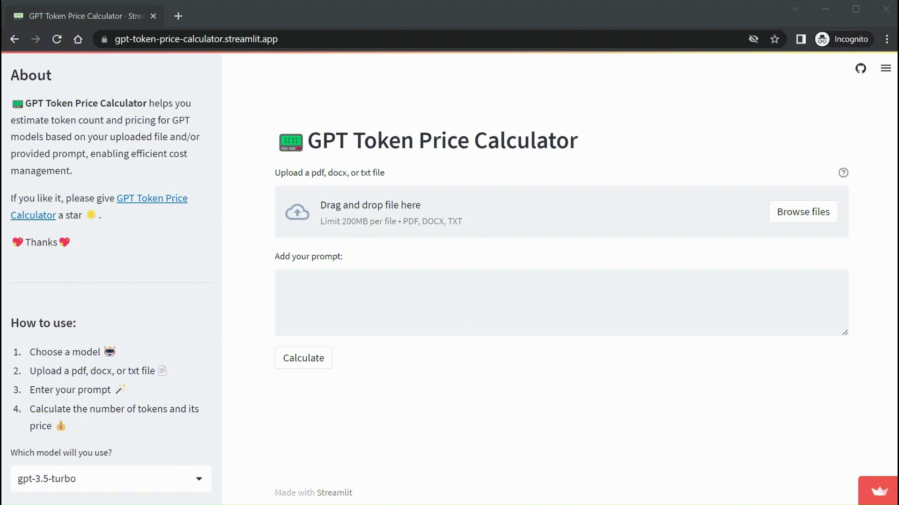

<h1 align="center">
📟GPT Token Price Calculator
</h1>

Calculate tokens and estimate the price for the **File** ➕ **Prompt** fed into the GPT model.

## 🎞 Demo



## 💻 Running Locally

1. Clone the repository 📂

```bash
git clone https://github.com/Allen1212/gpt_token_price_calculator.git
cd gpt_token_price_calculator
```

2. Install dependencies ✅

```bash
pip3 install -r requirements.txt
```

3. Run the Streamlit server 🚀

```bash
cd count_tokens
streamlit run main.py
```